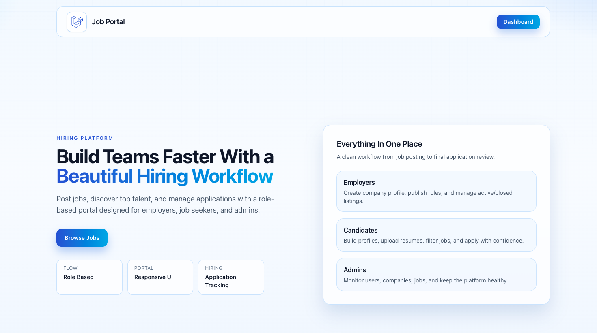
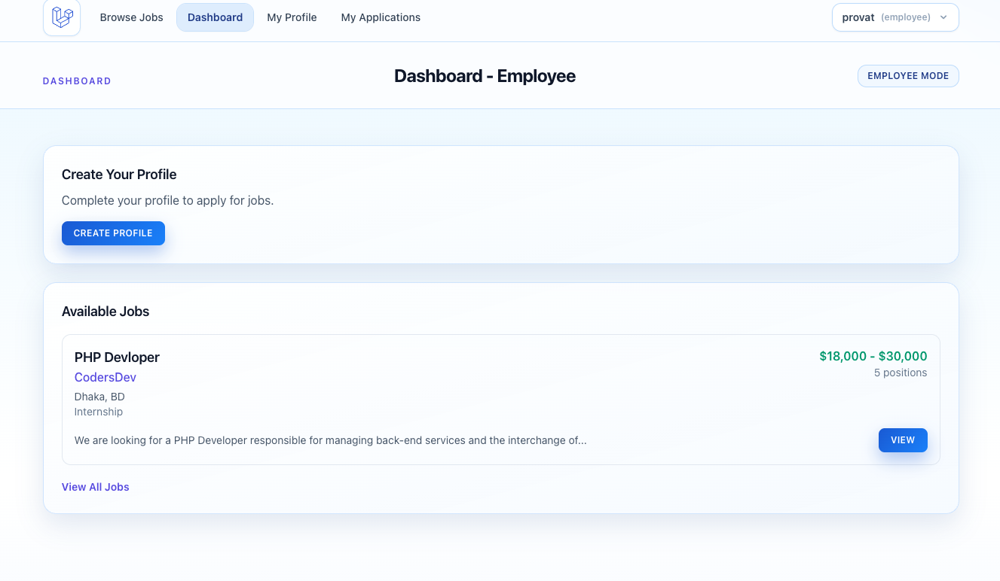
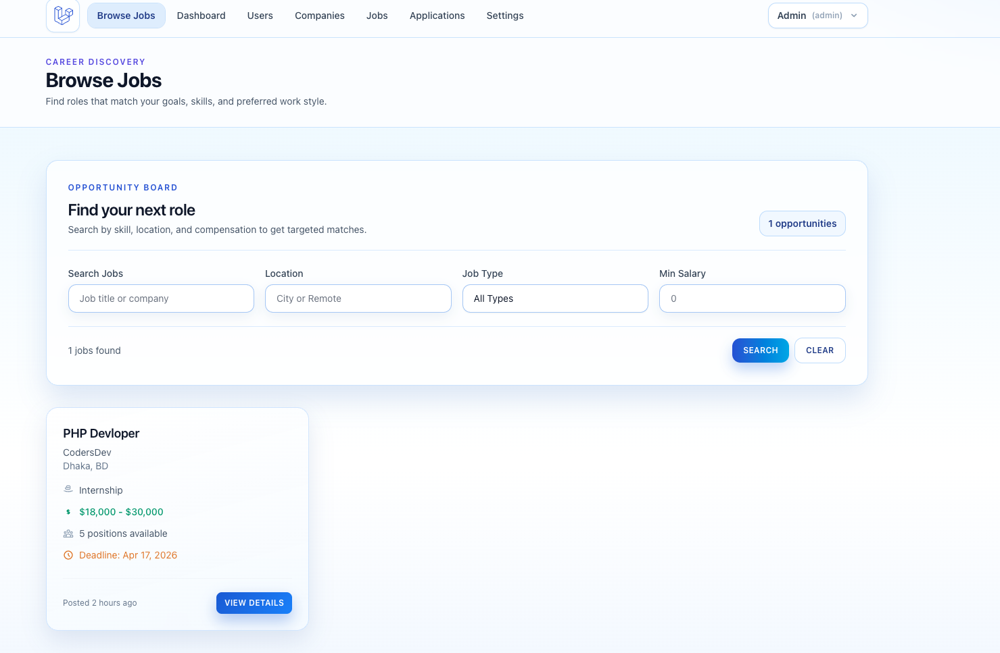
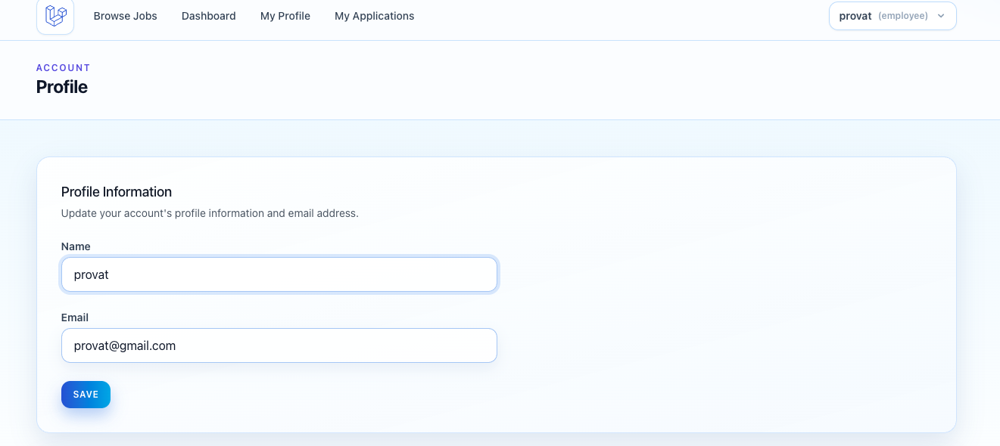
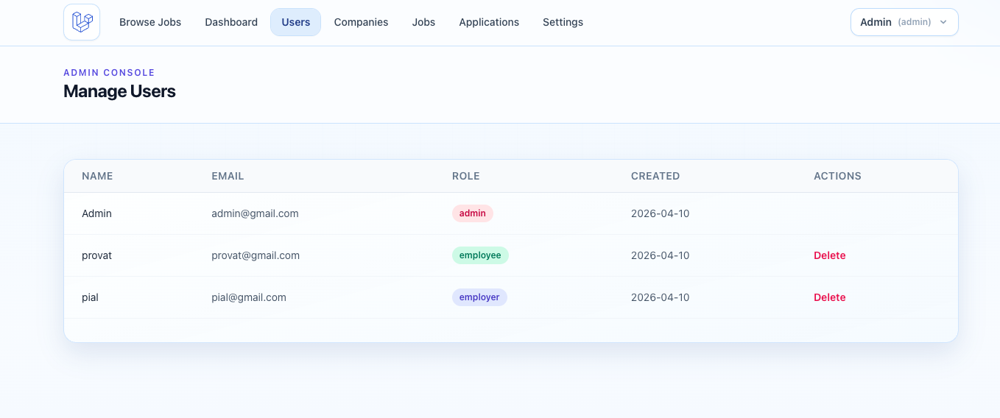
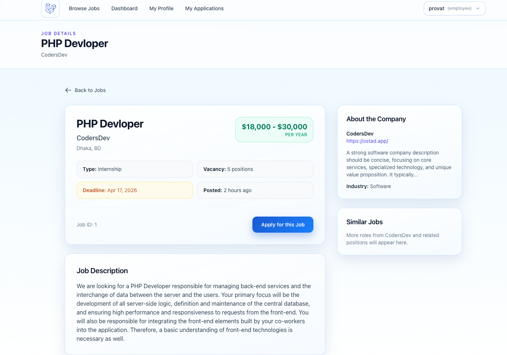

<div align="center">

# 🏢 Job Portal Application

[](https://laravel.com)
[](https://php.net)
[](https://tailwindcss.com)
[](https://mysql.com)
[](LICENSE)

A full-featured, role-based job portal where employers post jobs, employees apply, and admins manage the platform — built with Laravel 13.

</div>

---

## 📸 Screenshots

> _Add screenshots below by uploading images to your repo and referencing them._

| Landing Page | Job Listings | Employer Dashboard |
|---|---|---|
|  |  |  |

| Employee Profile | Admin Panel | Application Tracking |
|---|---|---|
|  |  |  |

---

## ✨ Features

| Role | Capabilities |
|---|---|
| **Public** | Browse and filter active job listings |
| **Employee** | Register, build profile, upload resume, apply to jobs, track application status |
| **Employer** | Create company profile, manage job postings, view applicant dashboard |
| **Admin** | Manage users, companies, and jobs; view system summary |

### Key Highlights
- Laravel Breeze authentication (register, login, password reset, email verification)
- Policy-based authorization for ownership control
- Job filters: title, location, type, salary range
- Duplicate application prevention
- Email notifications to employers and applicants on new applications

---

## 🛠 Tech Stack

- **Backend:** Laravel 13, PHP 8.3
- **Frontend:** Blade, Tailwind CSS, Alpine.js, Vite
- **Database:** MySQL
- **Auth:** Laravel Breeze
- **Queue / Cache / Session:** Database drivers

---

## ⚡ Quick Start

````bash
composer run setup
php artisan storage:link
php artisan db:seed
composer run dev
````

<details>
<summary>Manual setup</summary>

````bash
composer install
cp .env.example .env
php artisan key:generate
php artisan migrate
php artisan storage:link
php artisan db:seed
npm install
npm run dev
php artisan serve
````

</details>

### Prerequisites

- PHP `^8.3`
- Composer
- Node.js + npm
- MySQL

### Environment

Update `.env` for your setup:

````env
DB_DATABASE=your_db
DB_USERNAME=your_user
DB_PASSWORD=your_password

MAIL_MAILER=smtp        # Change from 'log' for real email delivery
APP_URL=http://localhost
````

---

## 🔑 Demo Accounts

| Role | Email | Password |
|---|---|---|
| Admin | `admin@jobportal.com` | `password` |
| Test User | `test@example.com` | `password` |

---

## 📁 Project Structure

````
app/
├── Http/Controllers/   # Business logic by module
├── Models/             # Eloquent models & relationships
├── Policies/           # Role & ownership authorization
└── Mail/               # Email notification classes

resources/views/        # Blade templates
routes/web.php          # Web routes
database/migrations/    # Schema definitions
````

## 📂 File Uploads

Uploaded files are stored on the `public` disk and publicly accessible via `storage:link`:

- Company logos → `storage/app/public/company-logos/.`
- Resumes → `storage/app/public/resumes/.`

---

## 🧪 Useful Commands

````bash
composer run dev    # Start server, queue, logs, and Vite
composer test       # Run test suite
npm run build       # Build assets for production
````

---

## 📄 License

Licensed under the [MIT License](LICENSE).
